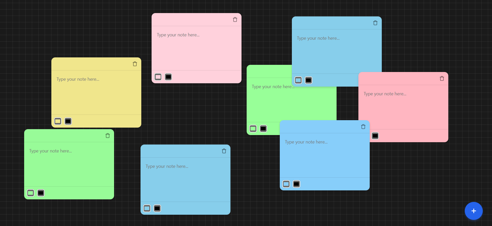

# Task Organizer

Task Organizer is a web application that allows users to create, manage, and organize notes in a visually appealing way. The notes can be dragged around the screen and customized with different colors.

## Features

- **Create Notes**: Click the plus button to add a new note.
- **Drag and Drop**: Easily move notes around the screen.
- **Color Customization**: Each note can have a unique background and text color.
- **Delete Notes**: Remove notes with a simple click on the trash icon.
- **Auto-Save**: Notes are automatically saved as you type.

## Technologies Used

- **React**: For building the user interface.
- **Supabase**: For backend database services.
- **CSS**: For styling the application.

## Installation

1. Clone the repository:
   ```bash
   git clone https://github.com/Shivam909058/task-organizer.git
   ```
2. Navigate to the project directory:
   ```bash
   cd task-organizer
   ```
3. Install dependencies:
   ```bash
   npm install
   ```
4. Start the development server:
   ```bash
   npm start
   ```
5. add info about supabase in .env file
   ```bash
   REACT_APP_SUPABASE_URL=your_supabase_url
   REACT_APP_SUPABASE_ANON_KEY=your_supabase_anon_key
   ```

## Usage

- Click the plus button to add a new note.
- Drag notes to reposition them.
- Use the color pickers to change note colors.
- Click the trash icon to delete a note.

## Screenshot



## License

This project is licensed under the MIT License.